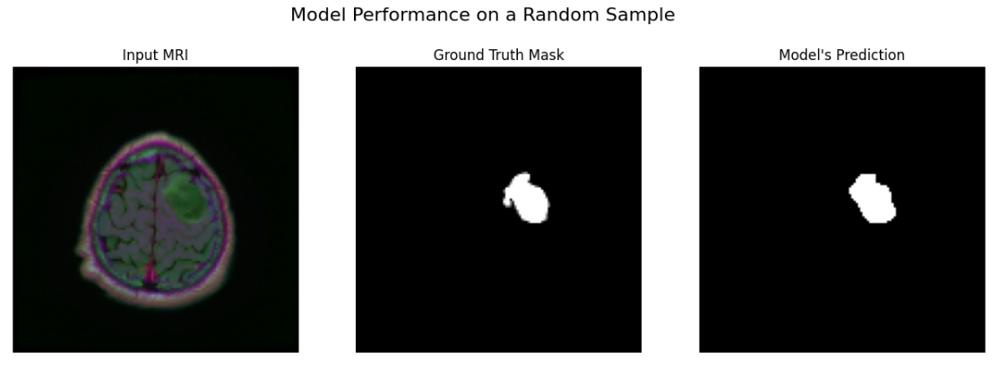

# Brain Tumor Segmentation using U-Net

This project implements a U-Net based deep learning model to perform semantic segmentation of brain tumors from MRI scans.

---

## Project Overview

The goal of this project is to accurately segment brain tumor regions in medical imaging. We leverage the U-Net architecture, which is highly effective for biomedical image segmentation due to its ability to capture both rich contextual information and precise localization details through its encoder-decoder structure and skip connections.

---

## Dataset

The model is trained on the **Brain MRI segmentation** from Kaggle.

- **Dataset Link:** [Brain MRI segmentation](https://www.kaggle.com/datasets/mateuszbuda/lgg-mri-segmentation)

---

## How to Run

To set up and run this project locally, please follow these steps:

1.  **Clone the repository:**

    ```bash
    git clone https://github.com/ErfanRezaei/Brain-Tumor-Segmentation-Using-U-net.git
    cd Brain-Tumor-Segmentation-Using-U-net
    ```

2.  **Install the required packages:**

    ```bash
    pip install -r requirements.txt
    ```

    Note: It's highly recommended to use a virtual environment to keep project dependencies isolated.

3.  **Download the dataset:**
    Download the data from the [Kaggle link](https://www.kaggle.com/datasets/mateuszbuda/lgg-mri-segmentation), extract `archive.zip`, and place the resulting `lgg-mri-segmentation` folder in the project's root directory.

4.  **Run the cells:**
    The entire workflow is documented in the `Brain Tumor Segmentation.ipynb` Jupyter Notebook. To run the project, start Jupyter Notebook and open the file.

---

## Example 1: Successful Segmentation



---
